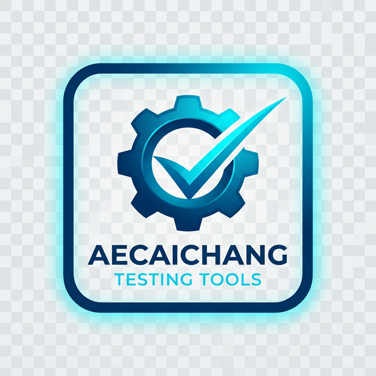

# 🛠️ Aecaichang Testing Tools

ชุดเครื่องมือสำหรับการทดสอบและพัฒนาซอฟต์แวร์ที่ออกแบบมาเพื่อความรวดเร็ว ประสิทธิภาพ และความสวยงาม (Premium UI/UX) พัฒนาด้วยเทคโนโลยีสมัยใหม่เพื่อให้ทีม QA และ Developer ทำงานได้ง่ายขึ้น



---

## 🌟 Key Features

ระบบประกอบด้วยเครื่องมือหลักดังนี้:

- **🔄 CSV to Excel Converter**: แปลงไฟล์ CSV หรือข้อมูลดิบให้เป็นไฟล์ Excel (.xlsx) ที่สวยงามพร้อมใช้งาน
- **🔁 Loop API Tester**: เครื่องมือสำหรับการทดสอบ API ในรูปแบบวนลูป (Looping) พร้อมระบบ History และ Parser
- **📦 Mock Data Generator**: สร้างข้อมูลจำลองสำหรับการทำเทสได้ในคลิกเดียว
- **🔣 Encoding Tools (Base64, JSON)**: ตัวแปลงและจัดระเบียบข้อมูล Base64 และ JSON ให้เป็นระเบียบ
- **📊 Product Query Tools**: ระบบค้นหาและจัดการข้อมูลผลิตภัณฑ์สำหรับการทดสอบเฉพาะทาง

---

## 🚀 Tech Stack

โปรเจกต์นี้สร้างขึ้นด้วยมาตรฐานการพัฒนาขั้นสูง:

- **Core**: [React 18](https://reactjs.org/) + [TypeScript](https://www.typescriptlang.org/) (Strict Typing)
- **Build Tool**: [Vite](https://vitejs.dev/) (เพื่อความเร็วในการ Build และ Hot Reload)
- **Styling**: [Tailwind CSS](https://tailwindcss.com/) (Modern & Responsive Utility-First CSS)
- **UI Components**: [Shadcn/UI](https://ui.shadcn.com/) (Custom Wrapper Components @/components/common/)

---

## 🛠️ Getting Started

### Prerequisites

- Node.js (version 18 or higher)
- npm or yarn

### Installation

1. Clone โปรเจกต์ไปยังเครื่องของคุณ
```bash
git clone https://testingtools.aecaichang.com/
```

2. ติดตั้ง Dependencies
```bash
npm install
```

3. เริ่มใช้งานโหมด Development
```bash
npm run dev
```

---

## 📁 Project Structure

```text
src/
├── components/       # Common UI Wrapper Components
├── features/         # ฟีเจอร์แยกตามโมดูล (CSV, Loop API, Mock, etc.)
├── assets/           # รูปภาพและสไตล์
└── lib/              # Shared utilities และ hooks
```

---

## ⚖️ License

Copyright © 2026 **Aecaichang**. All rights reserved.
Developed with ❤️ by **Antigravity AI Assistant** & **ChanChai Tasujai**.
